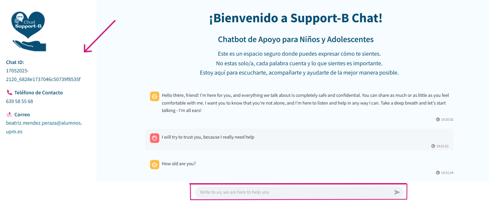
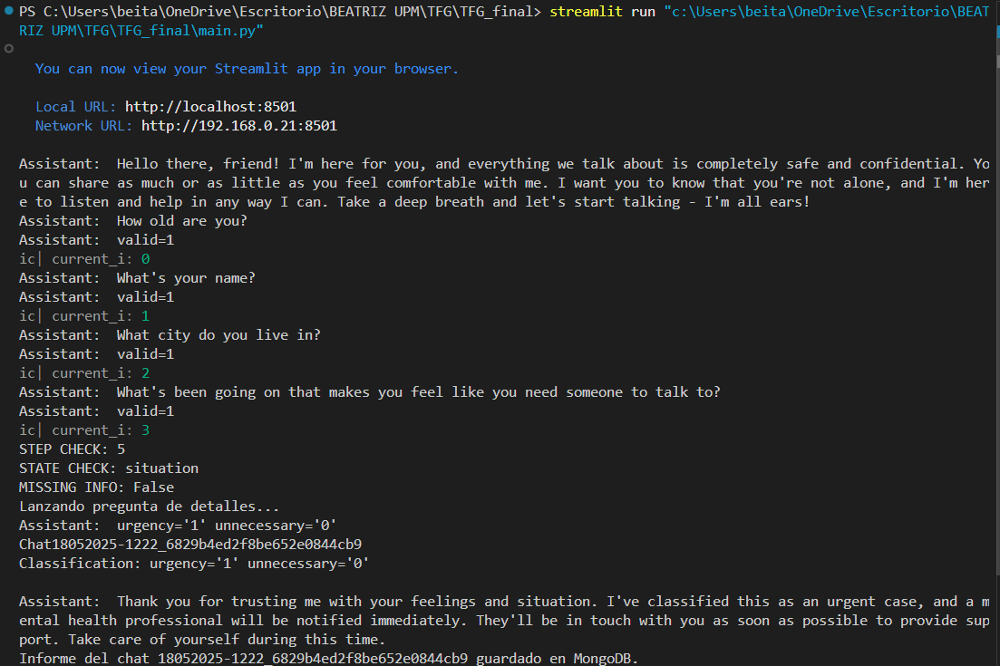
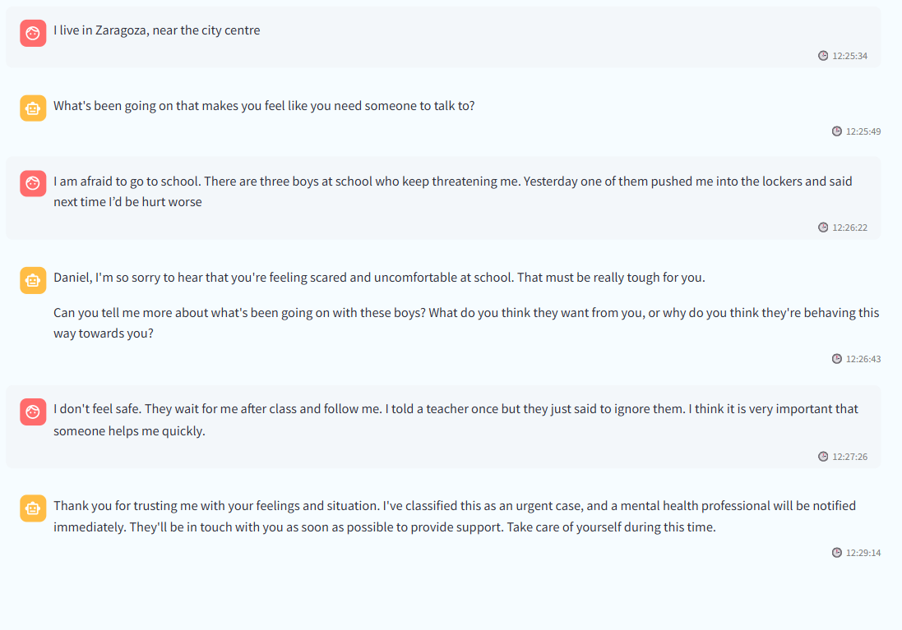
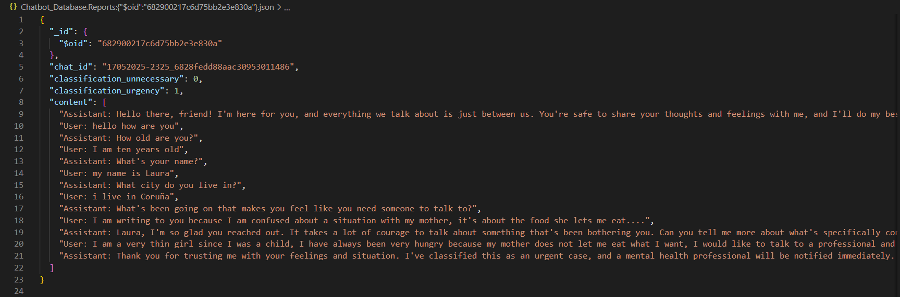

<h1> 💬 Design and Development of an Automated and Controllable Chatbot for Assistance of Children and Adolescents at Risk</h1>

<h2>📄 Summary</h2>

This project was created to enhance the efficiency and social impact of the Fundación ANAR’s support service by developing an AI-powered chatbot. 
The goal is to optimize human resources, ensure high-quality initial support, and promote responsible use of the help channel for children and adolescents in distress.

<b>Main objectives:</b>
<ul>
  <li>Evaluate how current language models perform in classifying simulated conversations in youth support scenarios.</li>
  <li>Design a modular and scalable architecture that can be integrated with other digital psychosocial support platforms.</li>
  <li>Explore the technical feasibility and performance of open-source AI tools in critical environments.</li>
</ul>

<h2>⚙️ Installation</h2>

<h3>Technologies Used</h3>
<ul>
  <li><b>Python 3.9+</b> – Core programming language.</li>
  <li><b>Streamlit</b> – Web interface for the chatbot.</li>
  <li><b>Langchain</b> – Manages prompt logic and LLM interaction.</li>
  <li><b>Ollama</b> – Framework to run LLMs locally (required for Llama 3.2).</li>
  <li><b>Llama 3.2 </b> – AI model for natural conversation and classification.</li>
  <li><b>MongoDB</b> – Stores chat history and classification reports.</li>
</ul>

<h3>Setup Instructions</h3>
<ul>

  <li><b>Set up MongoDB using Docker:</b>
    
Before running these commands, make sure you have <b>Docker</b> and <b>mongosh</b> installed. You can follow the official MongoDB instructions here: 
    <a href="https://www.mongodb.com/docs/manual/tutorial/install-mongodb-community-with-docker/" target="_blank">
    Install MongoDB Community with Docker</a>.

    <ol>
      <li><b>Pull the MongoDB Docker image:</b>
        <pre>docker pull mongodb/mongodb-community-server:latest</pre>
      </li>
      <li><b>Run MongoDB as a container:</b>
        <pre>docker run --name mongodb -p 27017:27017 -d mongodb/mongodb-community-server:latest</pre>
        
This maps port <code>27017</code> to your machine so MongoDB is accessible at <code>localhost:27017</code>.

      </li>
      <li><b>Check if the container is running:</b>
        <pre>docker container ls</pre>
      </li>
    </ol>
  </li>

  <li><b>Install and configure Ollama and Llama 3.2:</b>
    
Ollama is a local inference server to run large language models like Llama 3.2 on your machine.

    <ol>
      <li><b>Download and install Ollama:</b>
        
Go to <a href="https://ollama.com/download" target="_blank">https://ollama.com/download</a> and follow the setup instructions.

      </li>
      <li><b>Start the Ollama server:</b>
        <pre>ollama serve</pre>
      </li>
      <li><b>Run the Llama 3.2 model (3b version):</b>
        <pre>ollama run llama3.2:3b</pre>
        
This will download and launch the model automatically on first use.

      </li>
    </ol>
  </li>

  <li><b>Install Langchain:</b>
    
Langchain manages the conversation logic, prompt templates, and connection with the LLM.

    <ol>
      <li><b>Install Langchain Core:</b>
        
Used for building prompts and chains via <code>langchain_core.prompts</code>.

        <pre>pip install langchain-core</pre>
      </li>
      <li><b>Install Langchain Ollama:</b>
        
Required to connect Langchain with your Ollama LLM instance.

        <pre>pip install langchain-ollama</pre>
      </li>
    </ol>
  </li>

  <li><b>Install and launch Streamlit:</b>
    
Streamlit powers the user interface of the chatbot and runs in the browser.

    <ol>
      <li><b>Install Streamlit:</b>
        <pre>pip install streamlit</pre>
      </li>
      <li><b>Launch the app:</b>
        <pre>streamlit run main.py</pre>
        
It will open at <code>http://localhost:8501</code>.

      </li>
    </ol>
  </li>

  <li><b>(Optional) Configure OpenRouter key:</b>
    
If you're using OpenRouter as a model backend, set your API key:

    <pre>export OPENROUTER_API_KEY=your_key_here</pre>
  </li>

</ul>

<h2>📁 Repository Structure</h2>
<pre>
.
├── main.py                   # Main Streamlit app and logic
├── prompts.py                # Dynamic prompts and farewell messages
├── classification.py         # Classification and validation logic
├── chats.py                  # Examples of simulated chats
├── chats_classification.py   # Classification of simulated chats
├── README.md                 # Project documentation
</pre>

<h2>🧭 How It Works</h2>

When the user enters the platform, they are greeted with the main chatbot interface, which includes a clear title and a welcoming header.

The chatbot begins with an automatic welcome message. The user types a response into the input bar and presses "Enter" to continue.

Next, the chatbot initiates the data collection phase, asking for: <b>age</b>, <b>name</b>, <b>location</b>, and <b>situation</b>. The user simply replies, while the system validates each response in the background.

After successfully collecting all essential information, the chatbot asks one final, more detailed question about the user's situation. This answer is not validated, but it is included in the classification.

The conversation is then automatically classified based on urgency and appropriateness. A final farewell message is displayed based on this result.

A report is generated and saved to MongoDB, containing the full conversation and classification details. The terminal shows real-time updates for these operations.

Once the conversation ends, the input bar disappears, signaling to the user that the session is closed and preventing further interaction.

